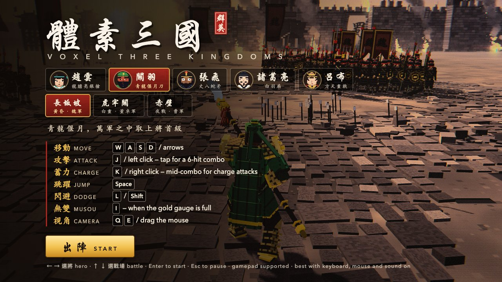
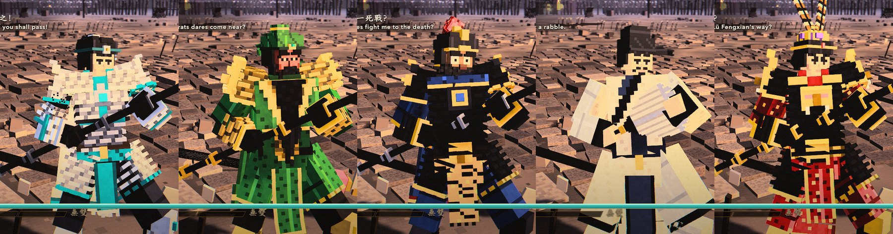
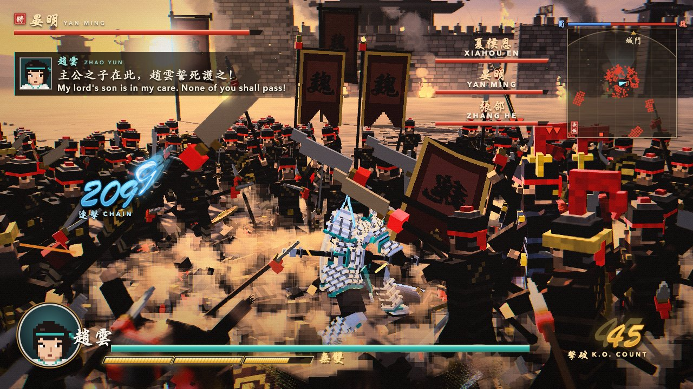
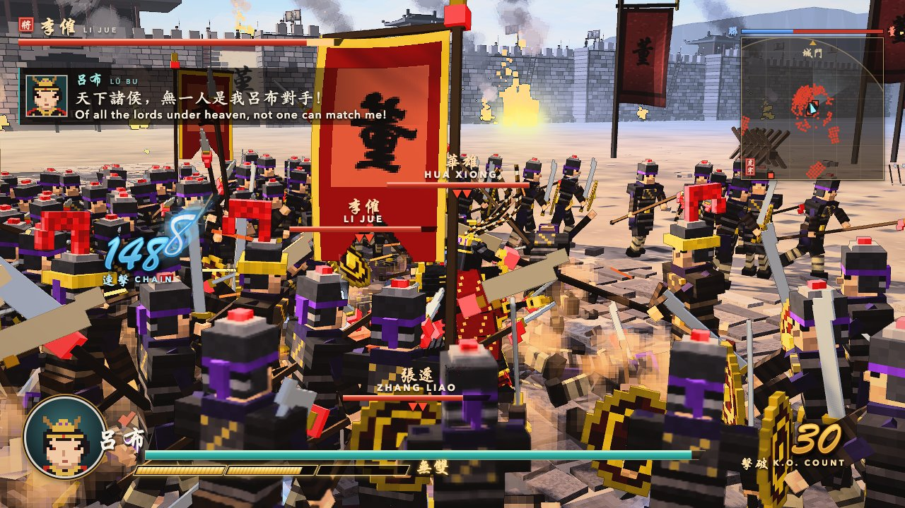
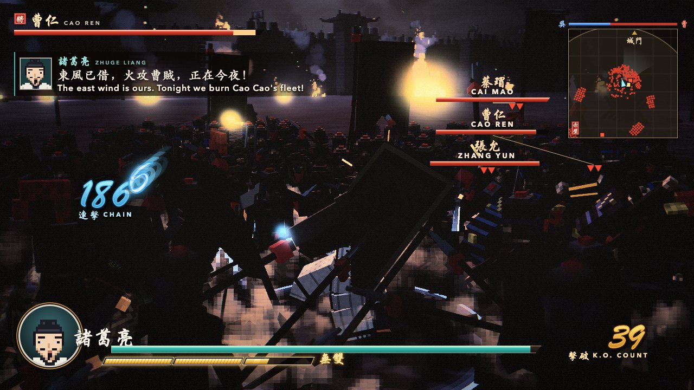
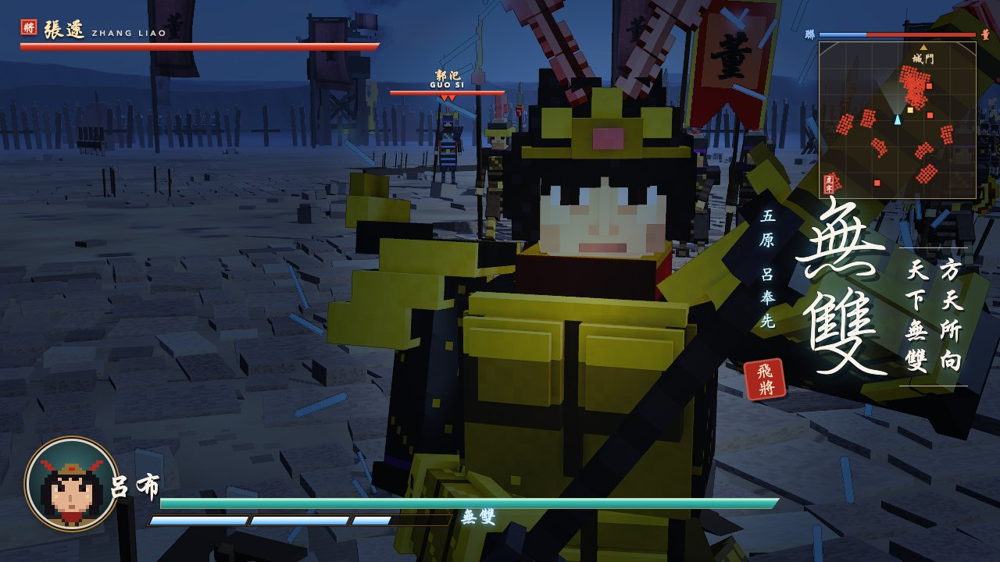

# 體素三國 · Voxel Three Kingdoms

<p align="center"></p>

一款浏览器里就能玩的体素风三国割草动作游戏，基于 Three.js。五名武将、三处战场，一人独闯数百敌军。

无需构建：纯 ES 模块，Three.js r186 已内置于 `vendor/three/`，逻辑以固定 60 Hz 确定性步进运行。

*A browser-playable voxel hack-and-slash set in the Three Kingdoms. Five officers, three battles, hundreds of soldiers. Plain ES modules, no build step.*

## 武将



| 武将 | 兵器 | 特点 |
| --- | --- | --- |
| **趙雲** 常山 | 龍膽亮銀槍 | 白银鳞甲、马尾与飘带、蓝色枪缨 |
| **關羽** 武聖 | 青龍偃月刀 | 绿袍金甲、吞肩兽、垂到腹部的美髯 |
| **張飛** 燕人 | 丈八蛇矛 | 豹头环眼、虎须、红缨铁盔、虎皮战裙 |
| **諸葛亮** 臥龍 | 白羽扇 | 纶巾鹤氅、八卦披风，出招时羽扇化出风刃 |
| **呂布** 飛將 | 方天畫戟 | 紫金冠、双雉鸡翎、黑金兽面甲、红锦袍 |

每名武将有自己的模型、兵器、飘动部件（披风、胡须、翎羽、缨穗都是弹簧链）、像素头像、台词和无双特写。

### 战斗风格

五人共用一套连招框架（6 段普攻、C1–C6 蓄力、冲刺攻击、跳攻、跳蓄），但各有自己的节奏、分量和招牌技（`src/hero/styles.js`，每名武将的 `STYLE`）：

| 武将 | 风格 | 手感 | 招牌 | 无双龙 |
| --- | --- | --- | --- | --- |
| 趙雲 | 槍術 · 迅捷 | 基准：快、准、连段流畅 | — | 青蓝 |
| 關羽 | 重刀 · 剛猛 | 慢 12%，范围 +20%，刀弧更宽，伤害 +30%，N3 起霸体 | 青龍斬：C1 与 N6 放出绿色月牙剑气 | 翠绿 |
| 張飛 | 蠻力 · 怒吼 | 慢 8%，击飞力度 +40%，伤害 +35%，N3 起霸体 | 當陽一喝：C1 先一声怒吼，震退 7 米内全部敌兵 | 金黄 |
| 諸葛亮 | 羽扇 · 遠程 | 近身较弱，每下普攻都甩出风刃 | C1 / C2 / 冲刺为光束；C3–C6、跳蓄为风刃齐射 | 冰白 |
| 呂布 | 無雙 · 霸體 | 快 6%，范围 +30%，伤害 +50%，全招霸体 | 冲刺突刺放出赤色月牙；C4 旋风更快更大 | 赤红 |

## 战场

| | | |
| --- | --- | --- |
|  |  |  |
| **長坂坡** · 黄昏 · 魏军 | **虎牢關** · 白昼 · 董卓军 | **赤壁** · 夜战火攻 · 曹军 |

每处战场有自己的天空、光照、画面风格、敌军旗号与军服颜色、敌将阵容，部分武将还有专属开场台词（比如虎牢关的关羽：「溫酒之間，斬汝華雄！」）。



## 运行

ES 模块无法通过 `file://` 加载，请用任意静态服务器托管此目录：

```sh
python3 -m http.server 8000
```

然后打开 http://localhost:8000 。需要支持 WebGL2 的浏览器，推荐使用独立显卡的桌面电脑。

## 操作

| 动作 | 按键 |
| --- | --- |
| 移动 | WASD / 方向键 |
| 普通攻击（6 段连击） | J / 鼠标左键 |
| 蓄力攻击 | K / 鼠标右键 |
| 跳跃 | 空格 |
| 闪避 | L / Shift |
| 无双（金色槽满时） | I |
| 旋转镜头 | Q E / 鼠标拖动 |
| 暂停 | Esc |
| 标题页选将 / 选战场 | ← → / ↑ ↓ |

也支持手柄。

## URL 参数

| 参数 | 说明 |
| --- | --- |
| `?hero=` | `zhaoyun` `guanyu` `zhangfei` `zhugeliang` `lubu` |
| `?stage=` | `changban` `hulao` `chibi` |
| `?look=` | 画面风格：`dusk` 黄昏电影 · `ink` 水墨 · `night` 夜战 · `bright` 明快 · `retro` 像素 |
| `?enemies=N` | 敌兵数量，0–2000（默认 300） |
| `?zoom=0.5` | 调试：拉近镜头 |
| `?musou` | 调试：开局无双槽满 |
| `?debug` | 调试：在控制台暴露 `game` / `scene` |

## 目录结构

```
index.html      入口、importmap、HUD 与标题页样式
src/heroes/     每名武将一个文件：模型、兵器、弹簧链、头像、台词、战斗风格
src/stages/     战场配置：天空、光照、敌军、台词
src/            core、hero、combat、crowd、musou、camera、vfx、post、world、audio、ui
vendor/three/   Three.js r186
```

新增武将：在 `src/heroes/` 仿照现有文件写一个定义（`build()` 返回各关节的体素块，`chains()` 返回飘动部件），再加进 `src/heroes/index.js`。

## 致谢与许可

- 基于 BubuAi 的 [Voxel Musou](https://github.com/mike007jd/voxel-musou)（MIT）。战斗、人群 AI、镜头、特效、后处理和音频系统都来自原作。
- 代码：MIT 许可，见 [LICENSE](LICENSE)。
- [three.js](https://threejs.org/)：MIT 许可。
- HUD 备用字体 `src/ui/brush.woff2` 是 Yuji Boku（Kinuta Font Factory）的子集，采用 SIL Open Font License 1.1 授权。

本项目为同人作品，与 KOEI TECMO 无关，也未获其认可。“真·三国无双 / Dynasty Warriors” 是 KOEI TECMO 的商标。本项目不包含任何原作游戏素材。
