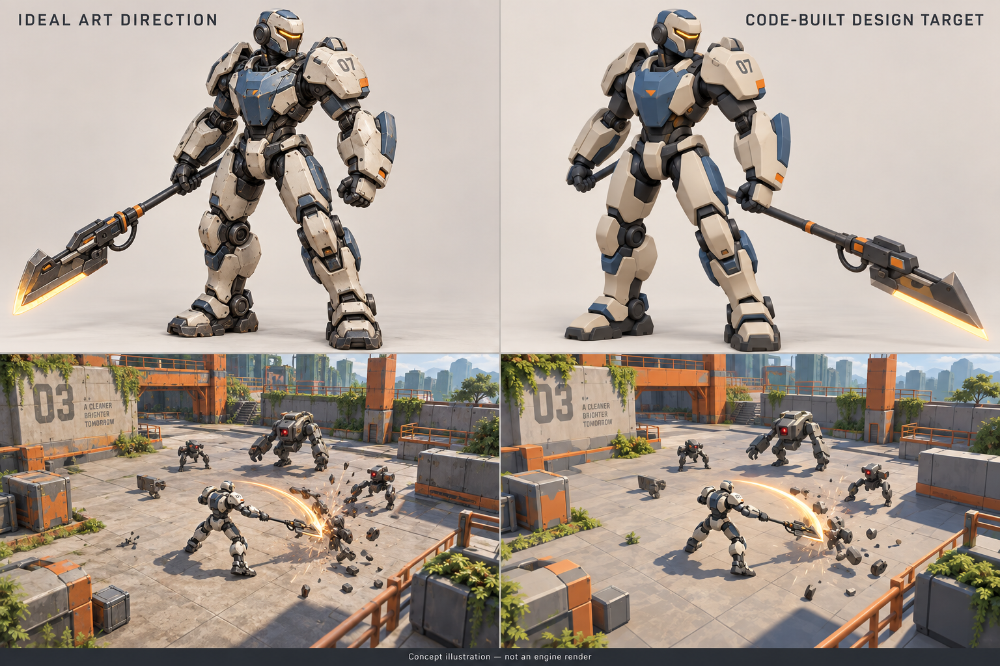

# Game vision — EXO: Hold the Line

Status: long-term creative reference, recorded from Ash's design discussions on 28 September 2026. The title and frame names are working names. This describes the intended complete game; it is not a claim about implemented features or a fixed release scope.

## How to use this document

Use this as the source of truth for the game's purpose, experience, and quality target. Keep implementation tasks and acceptance evidence separate. A small development milestone must not silently become a smaller final vision.

The macro direction is sufficient to guide production. Add detailed specifications when a feature is ready to be built and tested. Exact damage values, drop rates, mission lengths, content counts, and UI layouts remain open until prototypes give us evidence.

Companion references:

- [Studio and production approach](STUDIO-PLAN.md): proposed workflow and next development milestone.
- [Current playable demo](../DEMO.md): what can be played today and its controls.
- [Art direction concept](art/art-direction.png): visual reference, not an engine screenshot.

## The complete experience

A stylish PvE action RPG about a resistance pilot using powerful exosuits to reclaim a world overrun by machines. Deploy with a personally assembled fighting style, tear through robot armies, hunt dangerous specialists for their technology, defeat commanding machines, and return with new possibilities for the next build.

The game should feel powerful immediately and increasingly expressive with mastery. A newcomer can enjoy satisfying attacks and spectacular finishers. An experienced player can weave movement, combos, counters, positioning, and equipment interactions into a distinctive style, succeeding in content above their expected strength.

The emotional centre is the combination of physical combat and discovery: returning to the workshop with a recovered component and realising it could transform another frame's build.

## Established direction and open design

Ash has endorsed the overall complete-game vision and the generated art direction. These are the guiding commitments:

- PvE exosuit combat against machines; the separate boxing/PvP idea is outside this game's current vision.
- Adapt all five original fighting styles as the foundations of a varied roster.
- Preserve strong combat feel while improving enemy purpose, encounter variety, and build expression.
- Persistent loadouts and unlocks combined with upgrades acquired during missions.
- Significant foes and mini-bosses offer upgrades relevant to the player's starting build.
- Pursue the ideal polished stylised art direction. Prefer an efficient code-driven workflow; use a simpler treatment where the added detail does not justify its production or runtime cost.
- Make camera and controls comfortable without a mouse, with eventual mobile play in mind.
- Keep the world Christian-friendly, with powers explained through technology.

The following sections make the vision concrete with proposed designs. Names, particular mechanics, equipment slot counts, progression formulas, region counts, and mode priorities can change. Cooperative play is an eventual aspiration, not a dependency of solo progression or a commitment to build networking next. Cross-frame equipment sharing remains a design proposal; unrestricted moveset mixing has not been chosen.

## The pilot, workshop, and world

The player has a continuing identity as a resistance pilot. Frames are equipment they can learn, customise, and switch between. The workshop is a welcoming home inside a surviving settlement: suits stand in maintenance bays, equipment appears physically when fitted, and a nearby training area makes experimentation easy.

Recovered machinery and rescued engineers can improve the settlement and expand its services. Progress should be visible in a repaired facility, a newly functioning area, or people returning to safety. Story is delivered in brief encounters, environmental changes, and optional conversation. A substantial lore burden must not obstruct a quick combat session.

Possible regions include an occupied industrial city, an overgrown solar installation, a desert excavation complex, a coastal shipyard, and a vast machine manufacturing centre. Each should differ through encounter spaces, machine roles, hazards, materials, colour, and recoverable technology. These are setting concepts, not an exhaustive or mandatory map list.

The world has warmth: sunlight, greenery, painted workshops, and people worth protecting. Machines can be intimidating without making the entire game grim or visually grey.

## Frames and fighting identity

The original roster offers five starting points. Adapt movement and attack character while replacing historical presentation, spiritual imagery, and dragon effects with convincing machinery.

| Working frame | Original foundation | Intended combat identity |
| --- | --- | --- |
| Vanguard | Zhao Yun | Reach, thrusts, vaults, sweeping staff/lance attacks, controlled engagement |
| Breaker | Guan Yu | Heavy powered blade, committed swings, armour breaking, strong impact |
| Bastion | Zhang Fei | Forceful close combat, shoulder charges, shockwaves, counters, holding ground |
| Conductor | Zhuge Liang | Technical projectors, drones, projected cutting attacks, beams, space control |
| Striker | Lu Bu | Advancing combinations, rapid repositioning, aggressive bursts, risk and reward |

These are adaptations to design and balance, not five completed classes in the current demo. Each needs a recognisable silhouette, movement rhythm, weapon family, defensive behaviour, sound, and signature ability. A colour swap does not establish a new fighting identity.

Within a frame, support multiple approaches. A Bastion might store blocked impact for a powerful counter, use propulsion to charge through formations, or specialise in protective pulses and disruption. The frame supplies a coherent move language while the build changes its priorities and opportunities.

## Combat and control

The core includes readable light/heavy combinations, meaningful branches and finishers, mobility, targeted abilities, guard, and precisely timed counters. Preserve deliberate impact timing, animation anticipation, hit reactions, and satisfying crowd knockback.

Crowd battles and bosses share the same vocabulary. Free movement supports awareness and expression; optional lock-on supports focused engagements and aimed skills. Camera assistance should follow travel naturally, frame targets clearly, and yield to manual adjustment. Mouse use must remain optional.

Guard is a useful build axis with a limited resource. Timing a counter creates an advantage; holding defence indefinitely or repeatedly disabling a boss must not trivialise encounters. Defensive upgrades should create real alternatives to pure damage builds. Every frame needs fair ways to answer essential threats.

Retain a manageable set of inputs across keyboard and controller, and plan for touch input without assuming a complete mobile release immediately. Camera behaviour, interface scale, effects density, and control combinations should account for that future.

## Builds, equipment, and mission upgrades

A proposed loadout consists of a frame, weapon variant, signature ability, defensive system, and a small set of meaningful modules. Final slot counts are open. Weapon variants can alter heavy branches and finishers while retaining recognisable basic handling. Modules should often alter behaviour: energy generation, marking targets, movement, stagger, defensive conversion, or interactions between moves.

Allow some shared technology between frames where it creates interesting combinations. A targeting module could focus a heavy weapon's discharge onto a marked enemy. Preserve class identity and readable rules instead of allowing every animation or ability to combine arbitrarily.

During missions, offer milestone upgrades from significant foes, mini-bosses, objectives, and optional challenges. Rewards should reflect both the defeated technology and the player's equipped tools. A shield unit might yield defensive components; an assassin, propulsion technology; a sniper, targeting equipment. Let players pursue desirable reward families through understandable choices.

A small choice of compatible rewards lets players develop a build without depending on a single rare drop. Mix frame-specific options with useful general components. Explain why an upgrade is relevant and what it changes. Include fallback choices when a particular interaction is unavailable.

Example mission build:

1. Deploy with a heavy blade and counter-focused defence.
2. Defeat an armoured lieutenant and select a capacitor that stores blocked impact.
3. At a later milestone, choose whether that energy empowers a heavy strike, boost dash, or protective pulse.
4. Choose the heavy strike, then acquire a modifier that rewards hitting a marked weak point.
5. Against the boss, catch a readable attack, reposition through its follow-up, and spend the stored energy on the exposed reactor.

The reward changes how the player fights. Modest numerical improvements can support the system, but distinctive builds must not reduce to stacking percentages. Proc rules, resource limits, and boss resistance need clear boundaries so combinations remain exciting without accidental infinite loops.

## Enemies and encounters

Ordinary robots should be enjoyable to destroy quickly and useful within a formation. Threat comes from their roles, positioning, cooperation, and the circumstances of a fight.

Useful roles include swarmers that pressure space, shields that protect allies, repair units that sustain a formation, ranged units that control lanes, demolition units with committed charges, and mobile hunters that punish poor awareness. Elites can combine a familiar role with a distinctive move or modifier.

A shield line around a repair machine presents a target-priority problem. A ranged unit covering an escape route changes positioning. A demolition unit can disrupt the player's approach or become an opportunity if redirected into a formation. Each problem should permit multiple answers across builds.

Encounters alternate crowd-clearing pleasure with tactical pressure. Avoid relentless simultaneous attacks, obscured warnings, unavoidable stun chains, and excessive basic-enemy health. Harder content should test awareness, timing, and decisions through composition and behaviour as well as carefully controlled stat growth.

Bosses culminate the mission's ideas. They need distinctive silhouettes, clear attack sequences, openings, phase changes, and meaningful responses to different builds. A factory commander might have destructible weapon arms, a vulnerable reactor, and repair crews that create a choice between pressure and interruption.

Crowd-control builds can contribute stagger, interrupts, or useful add-clearing. Bosses recover or gain temporary resistance where necessary so they still get to fight. Damage-focused builds must also engage with boss mechanics. Bosses should be memorable opponents rather than enlarged health bars.

## Mission structure and progression

The complete loop is workshop preparation, deployment, evolving encounters and rewards, a culminating challenge, and a return with lasting discoveries. Missions offer routes or optional objectives that let the player choose risk, rewards, and session length.

Possible activities include reclaiming a depot, disabling a relay, protecting an evacuation, hunting a specialist, or taking an optional elite route. Reuse the combat vocabulary while giving the player different reasons to move and prioritise enemies. Exact mission lengths and checkpoint behaviour remain open; support satisfying short sessions alongside optional longer challenges.

Between missions, retain equipment, blueprints, frame mastery, cosmetic expression, and access to areas or challenges. Within a mission, temporary upgrades create a fresh power curve. Build ownership and experimentation should coexist.

Some persistent numerical growth is possible, but avoid rigid gear-score gates and unlimited stat inflation that erase skill. Farming should offer understandable targets and worthwhile discoveries. Inventory comparison, duplicate handling, salvage use, and recovery after defeat need separate design before implementation. Do not introduce onerous inventory maintenance or mandatory daily chores by default.

## The complete range of play

- Campaign missions introduce regions, enemy roles, resistance characters, and progression.
- Repeatable expeditions vary routes, encounters, and rewards.
- Optional extreme encounters and escalating challenges reward mastery.
- An endless defence mode supports sustained crowd combat and build experimentation.
- Eventual cooperative missions allow builds to create opportunities for one another while preserving a complete solo experience.

Co-op introduces significant simulation, networking, camera, reward, and balance work. It belongs to the long-term vision; it should receive its own design and feasibility work before production commitments. Competitive PvP remains a separate game direction.

## Art and presentation target

This image was generated during the design discussion. Both panels are concept illustrations, not screenshots, production models, or performance evidence. The left is the preferred visual ambition; the right illustrates a simpler geometry treatment that remains attractive. Neither panel defines Three.js's rendering ceiling.

Pursue polished stylised 3D with strong mechanical shapes, articulated machinery, expressive proportions, controlled materials, and intentional lighting. Voxel rendering is not a requirement of the final game.

Priorities, in order of perception:

1. Readable silhouette, proportions, pose, and combat space.
2. Animation weight, anticipation, contact, recovery, and physical response.
3. Coherent colour, lighting, shadow, and material separation.
4. Distinctive equipment and effects that communicate builds and threats.
5. Additional surface wear, small mechanical detail, and environmental richness where they remain visible and affordable.

Use shaped and bevelled armour, broad painted surfaces, exposed joints, and readable machinery. Resistance equipment is repaired and personalised; enemy machines look manufactured for specific purposes. Avoid covering every surface in tiny details.

Effects have a technical origin: pressure waves, thrusters, heated cutting edges, electrical discharge, armour fragments, and venting machinery. Dragon-shaped attacks require an intentional replacement of their visible motion and impact presentation, not merely hiding a model while leaving unexplained damage.

Equipment should appear on the suit. A capacitor can occupy a forearm mount; propulsion changes can alter thrusters; a major upgrade can unfold a component. Build changes become visible without overwhelming the silhouette.

Audio carries weight through motor loading, mechanical locks, metal contact, and distinctive enemy warnings. Camera shake, hit flashes, trails, and particles support impact while preserving readability. Provide suitable intensity controls and scalable effects.

The workflow should favour code-driven asset creation and a browser studio sharing the game runtime. Blender or another tool remains available when a specific task benefits enough to justify it. The production method should serve the artwork and iteration speed.

## Values and tone

The player protects people, restores communities, and uses strength responsibly. Spectacular abilities come from equipment and engineering. Avoid demonic, occult, or unwanted spiritual imagery and powers.

Faith references, if later chosen, should be natural, optional where appropriate, and treated respectfully. Divine intervention and theological gameplay systems are not part of the current design. Do not assume they will be added. Robot destruction provides spectacle without requiring gore.

Aggressive monetisation is not a design driver. Monetisation and online services remain undecided; they should not distort the combat or progression vision.

## What makes the vision successful

The player recognises a frame by how it moves; an upgrade changes a decision; an enemy creates a readable tactical problem; and a new component inspires another build. The game looks appealing both in a still image and during a crowded fight. A short session feels worthwhile, while deeper mastery supports long-term play.

Measure progress through playable outcomes and Ash's feedback. Keep source checks, real browser renders, performance measurements, and player acceptance distinct. The existing combat demo is the foundation; the complete experience described here remains the destination.

## Decisions to resolve through design and prototypes

- How many permanent equipment slots and how much cross-frame sharing best support identity?
- Which resources, upgrades, and rewards survive defeat or mission completion?
- How much persistent stat growth preserves the ability to punch above one's weight?
- How do route choice, mission length, and checkpoints support both short and extended sessions?
- What visual detail survives the real combat camera and target device budgets?
- Which minimum browser, controller, and mobile targets define performance acceptance?
- When should cooperative play enter production, and what authority model does it need?

Changes to the central vision should be recorded explicitly. Answers to these questions may evolve without losing the intended complete game.
